# Sabeel Institute Kanban — User Manual

*For app version 0.10.2 · August 2026*

Welcome! This guide covers everything you can do in Sabeel Kanban — from finding
your first board to running boards and approving accounts. It is organized by
what you do: **everyone** starts with Part 1; if you **run a board**, add Part 2;
**admins** add Part 3. Part 4 is a quick "How do I…?" index you can skim any
time.

The app works the same on the website
(https://sabeel-institute-kanban.web.app) and the Android app — same account,
same data, live everywhere. It is **phone-first**: the mobile layout is its own
thing, not a squeezed desktop board. Throughout this guide, where the phone and
browser layouts differ, you'll see them side by side.

---

## The big picture (2 minutes)

1. **Work lives on boards.** A board is a set of **columns** (like *To Do → In
   Progress → Done*) holding **cards**. Each card is one piece of work.
2. **You see the boards you've been added to** — nobody else's, unless you are
   an admin. Each board has one or more **owners** who run it: they add people,
   shape the columns, and decide who else owns it.
3. **A card carries everything about a task** — a description, a priority, a due
   date, the people assigned, labels, and a comment thread. Open it to see or
   change any of that in one place.
4. **Everything is live and shared.** Move a card and everyone watching sees it
   move. **My Work** gathers every card assigned to you, across every board, so
   you never have to go board-hunting to find what's yours.

That's the whole system. Everything below is detail.

---

# Part 1 — For everyone

## 1.1 Signing in

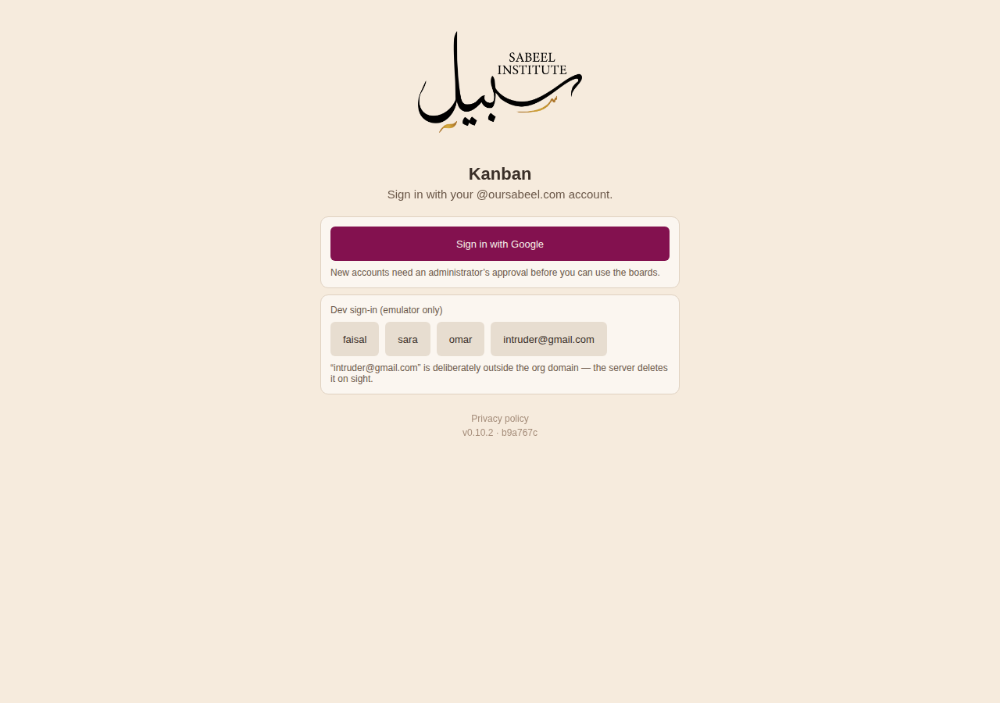

Open the app or website and tap **Sign in with Google**. Sign-in is restricted to
your **@oursabeel.com** account — no other account works, and there is no password
to remember.

### On a phone, sign in on the website first

**The very first time only.** The phone app signs you in; it does not set your
account up. So sign in once at
[the website](https://sabeel-institute-kanban.web.app), and after that the app
works normally on the same account.

Install the app before doing that and it will say **"This account isn't set up
for the app yet."** Nothing is wrong — sign in on the website, then open the app
again.

### First time? You'll wait for approval

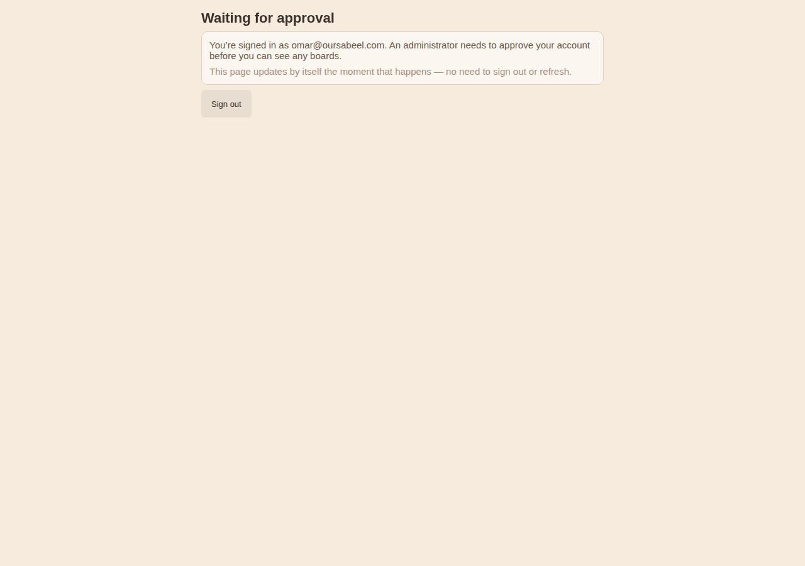

New accounts land on a **"Waiting for approval"** screen. An administrator has to
approve your account before you can see any boards — this is deliberate, and it
takes them one tap. Leave the page open: it lets you in by itself the moment they
approve you, with no need to sign out or refresh. If you seem stuck here, contact
your admin.

## 1.2 Finding your way around

A slim navigation bar is always in reach — **along the bottom on a phone**, and
**down the left side in a browser**. It carries the places you move between:

  <figure>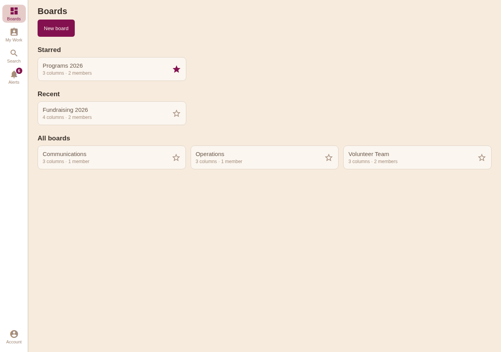<figcaption>In a browser — a rail down the left</figcaption></figure>
  <figure>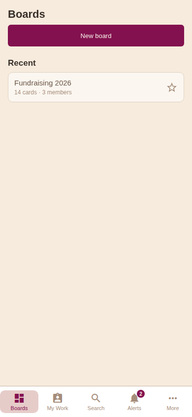<figcaption>On a phone — a bar along the bottom</figcaption></figure>

- **Boards** — your board list, the home screen.
- **My Work** — every card assigned to you, across every board.
- **Search** — find a card by its words.
- **Alerts** — what you've been told about; a badge shows how many are unread.
- **More** — everything that isn't a place you go often: **Stats** (admins),
  **People** (admins), and **Sign out**. It also shows the version of
  the app you're running, which is the first thing to quote if something looks
  wrong.

Open a board or a card and the phone's bottom bar steps aside, giving the board
the whole screen; it returns when you go back to a list. In a browser the left
rail stays put — it's narrow enough to keep out of the way.

## 1.3 Your boards

**Boards** lists everything you can open. Tap the **star** beside a board to keep
it at the top; boards you've opened recently follow, then the rest alphabetically.

Every board shows as a card in a grid on wide screens, and as a single-column list
on a phone. If your account can create boards, **New board** is at the top (see
 Part 2).

## 1.4 Inside a board

  <figure>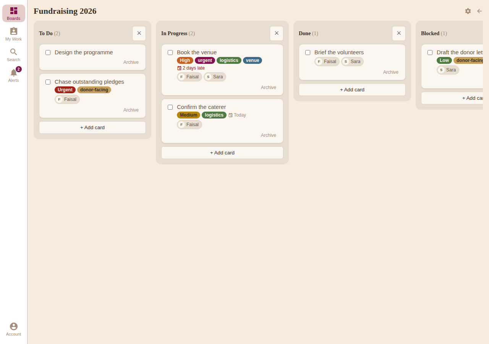<figcaption>In a browser — every column at once</figcaption></figure>
  <figure>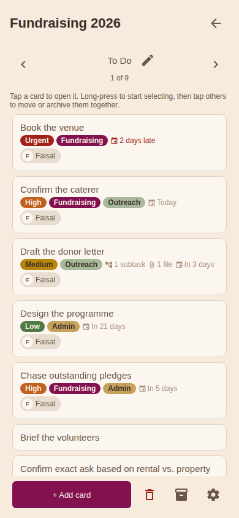<figcaption>On a phone — one column, swipe between</figcaption></figure>

A board is columns of cards. **In a browser** you see every column at once. **On a
phone** one column fills the screen — swipe left and right to move between them,
or tap the **arrows** either side of the column name. Under the name it tells you
where you are ("2 of 4").

Each card shows, at a glance: its **title**, a **priority badge**, its **labels**,
its **due date** (red if overdue), and the **people assigned** (as name chips) —
so you can read a card without opening it. A card with no priority set shows no
badge. Tap **+ Add card** at the bottom of a column, type a title, press Enter —
that's a new card.

**On a phone the row along the bottom holds everything else**: beside **+ Add
card** are icons to delete the column (owners of the board only), open the
board's **archived cards**, and open the board's **settings** — or, if you do not
own it, its **members**, which is the same screen without the controls. They sit
there rather than in the header so the board's name has the top row to itself.

## 1.5 Working with a card

Tap any card to open the full view.

  <figure>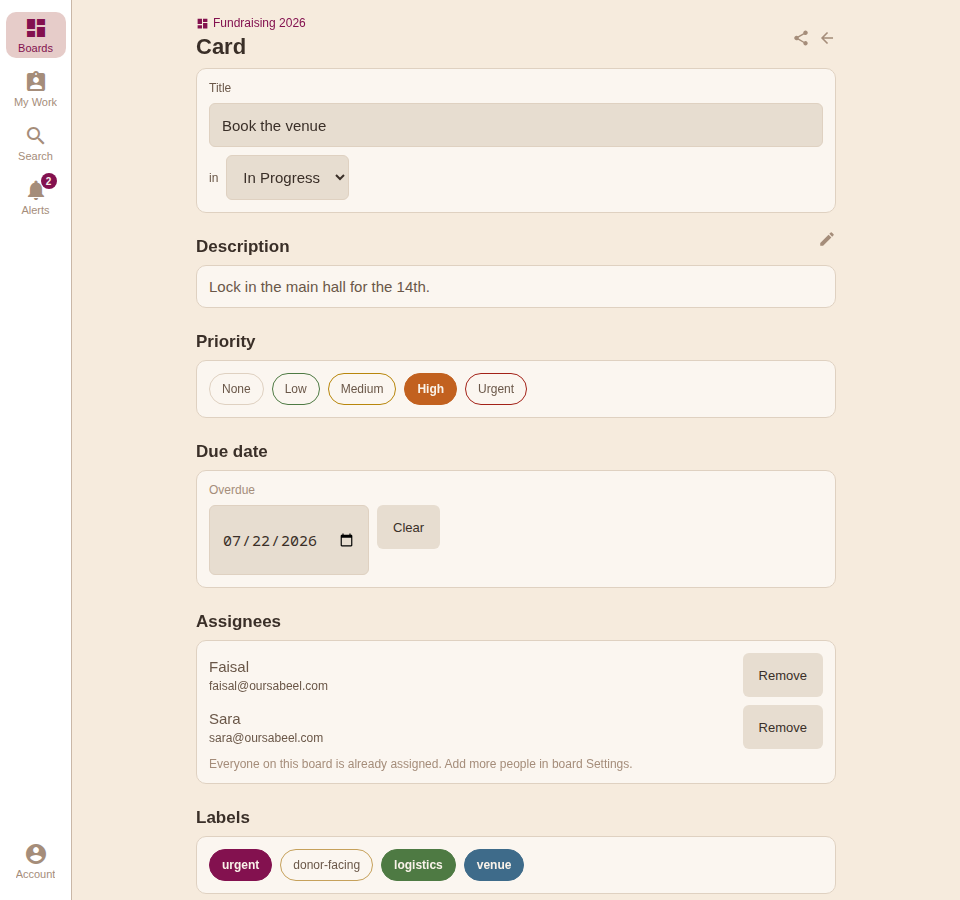<figcaption>In a browser</figcaption></figure>
  <figure>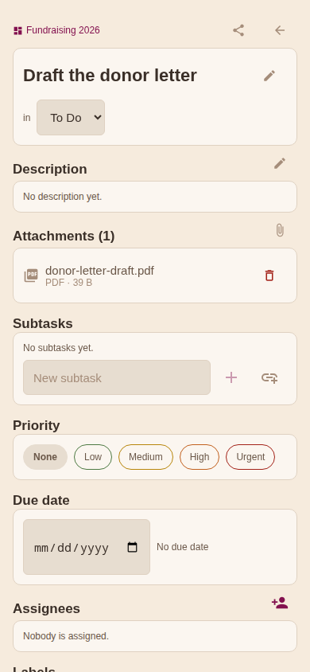<figcaption>On a phone</figcaption></figure>

- **Title** — shown in full as the card's heading, however long it is. Tap the
  **pencil** to edit it, then **Save**.
- **Column** — a dropdown showing where the card sits. Change it to move the card
  without leaving it.
- **Description** — formatted text. A small row of buttons above the box gives
  you **bold**, *italic*, a **bulleted list**, a **numbered list** and a
  **link**. Select some words and tap a button, or tap it first and start
  typing. **Save** to keep it, **Cancel** to discard.

  Those five are the whole set, on purpose — no headings, colours, tables or
  fonts. A card is a note about a piece of work, not a document, and the app is
  deliberately not ClickUp.

  Two shortcuts, if you like typing: start a line with `- ` for a bullet or
  `1. ` for a number, and it becomes a list as you go.

  **Web addresses become links by themselves.** Paste or type one and it turns
  into something people can tap — you don't need the link button for that. Use
  the link button when you want a word to carry the address instead, like
  [the handbook](https://example.org).

  The link button asks for two things: the **address** first, then the **text to
  show**. If you selected some words before tapping it, they are already filled
  in as the text, and you only need the address. Leave the text empty and the
  address stands in for it. **Add link** stays greyed out until the address is
  one the card can actually open — it must start with `http://`, `https://` or
  `mailto:`.

  **Pasting from elsewhere is safe and simplified.** Copy from a document or a
  web page and anything the card cannot show — headings, colours, tables,
  images — arrives as ordinary text with the bold, italics, lists and links
  kept. Nothing is silently mangled; it is just reduced to what a card holds.
- **Attachments** — files on the card. See below. A card with files shows a
  small **paperclip and count** on the board, so you can see which cards carry
  something without opening them.
- **Subtasks** — see below.
- **Priority** — none / low / medium / high / urgent, shown as a coloured
  **badge** on the card face (e.g. *Urgent*); *none* shows no badge.
- **Due date** — a whole day, not a time. Pick it from a calendar; **Clear**
  removes it. An overdue card shows in red and says *Overdue*.
- **Assignees** — anyone on the board. Tap the **add-person** icon beside the
  *Assignees* heading, then pick a name; the **remove-person** icon on a row
  unassigns them. They show as **name chips** on the card face, the card lands in
  each person's **My Work**, and they're notified.
- **Labels** — a short vocabulary shared by **every** board, shown as coloured
  **badges** on the card face. Press **+** to add one to the shared set and this
  card at once.
- **Comments** — discuss the work, with the same five formatting buttons the
  description has. Type **@** to pull someone in and they're notified; that
  works anywhere in a sentence, not only at the end. A list of everyone on the
  board appears above the box — **anyone assigned to the card comes first**, and
  it scrolls if the board is large. Keep typing to narrow it, or tap a name. On a computer you can stay on the keyboard:
  **↑/↓** to move, **Enter** or **Tab** to pick, **Esc** to dismiss.

  The list closes when you click away, and picking a name never loses your place
  in the box.
- **Subscribe** — the **bell** in the card's header. Tap it to hear about new
  comments on a card even when it isn't assigned to you; tap again to stop. It
  turns solid while you're subscribed. Subscribing is about the *conversation* —
  nothing else on the card notifies you. A card assigned to you already sends you
  its comments, but subscribing as well means you keep hearing about it if you're
  later unassigned.

  You can edit your own comment with the **pencil**, and the **@** works there
  too — mention someone in an edit and they're told, once. Correcting the wording
  afterwards doesn't notify anyone again.
- **Activity** — who changed what, and when, including subtasks being linked and
  unlinked. Written by the system, so no one can edit it.

Ordinary actions — move, archive, assign, delete — are **icons**, not big
buttons, so a card stays compact. Each icon has a label for screen readers.

**The back arrow is the same everywhere.** Any screen you opened from another one
has a **←** in its top right; it never appears as the word "Back".

### The formatting buttons

  <figure>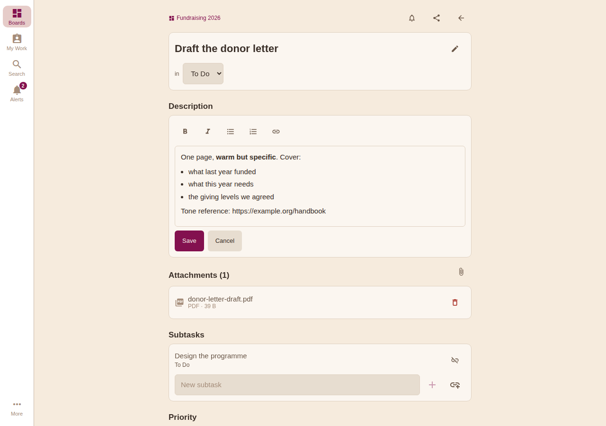<figcaption>In a browser</figcaption></figure>
  <figure>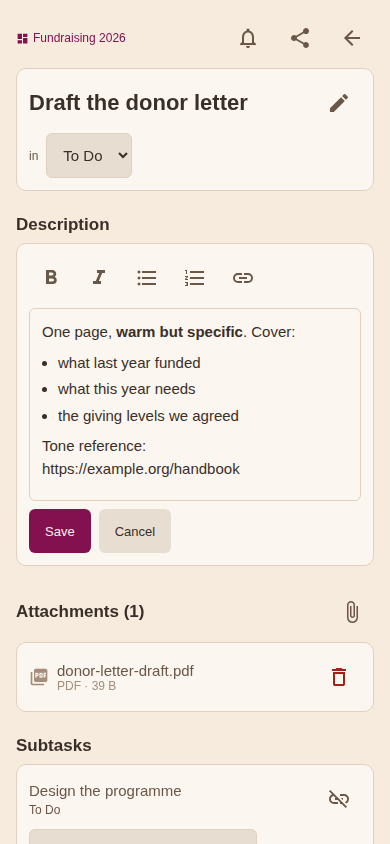<figcaption>On a phone</figcaption></figure>

The same five buttons sit above the description and above the comment box, on a
phone and on a computer alike. A button takes on a **soft coloured background**
while the cursor sits in text it already applies to, so you can tell bold from
not-bold without selecting anything first. They are icons, like the rest of the
app; each one is labelled for screen readers.

You are editing the finished text, not writing codes: what you see in the box is
what everyone else sees on the card.

### Attachments — putting files on a card

Tap the **paperclip** beside the *Attachments* heading.

**On a computer** that opens your file browser. **On a phone** you're asked where
from: **Choose a file**, **Photo library**, or **Take a photo** — so a receipt or
a whiteboard can go straight onto the card without saving it anywhere first.

  <figure>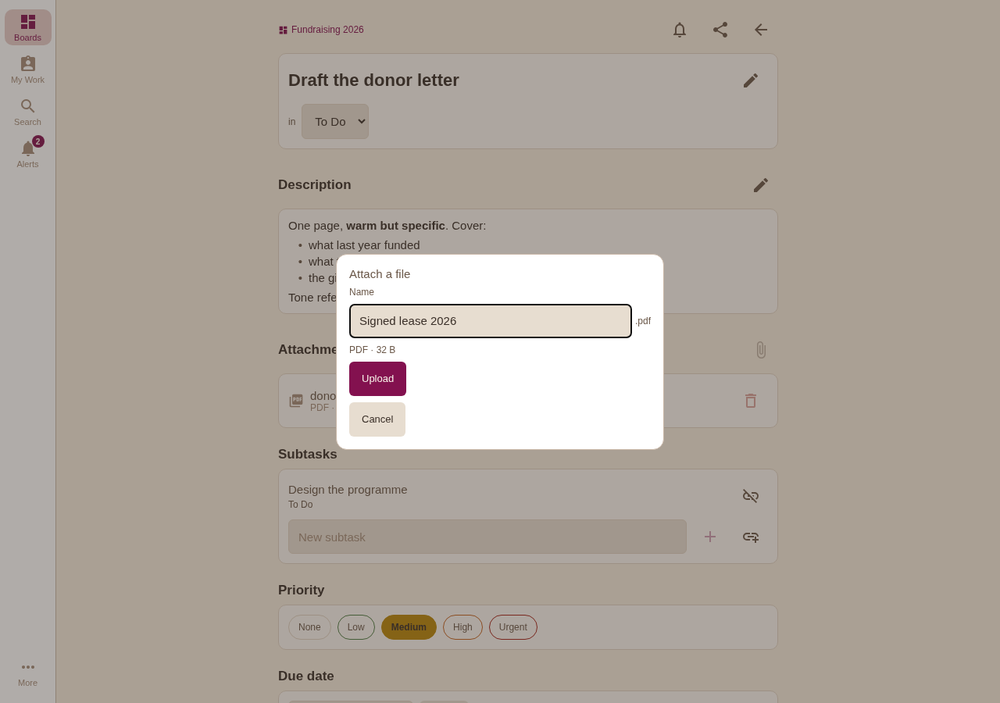<figcaption>Naming a file before it uploads</figcaption></figure>
  <figure>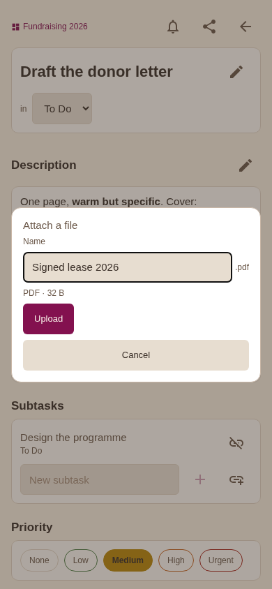<figcaption>On a phone</figcaption></figure>

**Then you get to name it.** Before the upload starts, a box shows the file's
name, size and kind. Change the name if you want to — `IMG_20260815_113244`
means nothing to anyone next week, `Signed lease` does — and press **Upload**.
Leave it alone and press Upload to keep the name it came with.

The **extension** (`.pdf`, `.png`) sits beside the box and isn't editable, and
that's deliberate: it's how your phone or computer knows what to open the file
with. A file with no extension — and a name that merely happens to contain a dot,
like `Notes on v1.2 planning` — is yours to edit all the way through. If the file
is over 10 MB the box says so and won't let you upload it, rather than letting
you wait and then failing.

You can only name a file at this point — **not afterwards**. If you get it
wrong, remove the file and attach it again.

- **Up to 10 MB per file**, any type, as many as you like on one card.
- Each file shows its **name, kind and size**. Tap it to **open it** — a PDF in
  your PDF reader, a photo in your gallery, everything else in whatever app you
  normally use for it.
- The **bin icon** removes a file. **Anyone on the board can remove any file**,
  not just whoever added it — attaching the wrong thing is an easy mistake and
  shouldn't need chasing someone else. It asks first, and it cannot be undone.
- Attaching and removing both appear in **Activity**, with who did it.

While a file is uploading you'll see a progress bar. If it doesn't finish — you
lost signal, or closed the app — the file simply isn't added; nothing half-made
is left on the card.

Files live with the card. Move the card to another board and they go too;
archiving a card keeps them. Deleting a card permanently deletes its files.

### Finding an archived card

Archiving takes a card off the board but **keeps it**. Tap the **archive icon**
— in the row along the bottom on a phone, in the header in a browser — to see
everything archived on that board, **most recently archived first**. Each card
carries two icons: **restore** puts it back on the board, and the red **bin**
deletes it permanently. Anyone who can archive can restore; permanent deletion
stays with the board's owners and admins, and it **asks first** because nothing
brings a deleted card back.

If the column a card came from has since been deleted, it comes back in the
**first column** and says so — rather than refusing to come back at all.

### Subtasks — breaking a card down

A card can be broken into **subtasks**, which are simply other cards on the same
board, linked to it.

- Type a title under **Subtasks** and tap **+** to create one. It's made in the
  same column as the card you're on.
- The **link icon** beside it attaches a card that's already on the board. There's
  a filter box, because a board can hold a lot of cards.
- Tap any subtask to **jump straight to it**; it opens like any other card, with
  its own column, assignees, due date and comments. The subtask shows
  **Subtask of** at the top — tap that to come back up.
- The unlink icon separates the two cards again. **It does not delete anything** —
  the subtask stays on the board as an ordinary card.
- A parent card shows a small **N subtasks** marker on the board, so you can tell
  at a glance that it breaks down further.

A subtask is a real card, not a checklist item: it moves through columns, gets
assigned, and can be discussed like anything else. A card can be a subtask of only
one other card, and both must be on the same board.

### Sharing a card

The top of every card shows **which board it's on** — tap it to jump straight to
that board. Beside the back arrow is a **Share** button. It hands the card's link
to your phone's share sheet — WhatsApp, Google Chat, a text, whatever you use — or,
on a computer, copies the link to paste anywhere.

Whoever opens the link lands directly on that card, as long as they're signed in
and a member of its board. If they aren't a member, or the card has been deleted,
the link says so instead of opening a blank screen.

### Moving cards

**In a browser**, drag a card between columns. **On a phone**, long-press the card
and pick the destination column — dragging isn't used on a screen that already
swipes between columns, where a drag would be ambiguous.

## 1.6 Doing several cards at once

  <figure>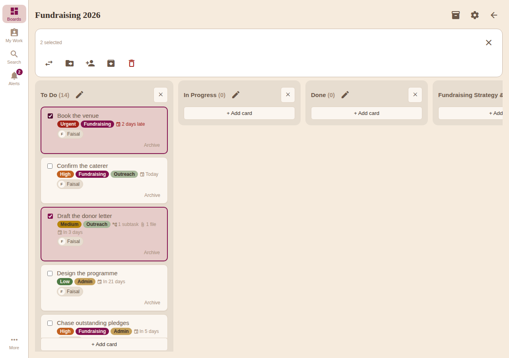<figcaption>In a browser — tick the boxes</figcaption></figure>
  <figure>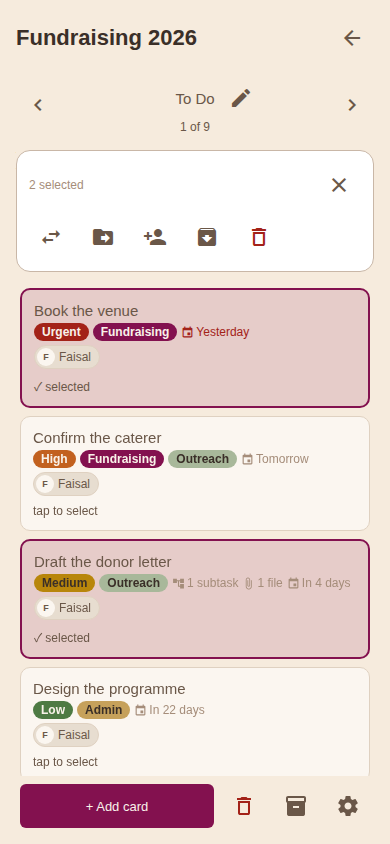<figcaption>On a phone — long-press, then tap</figcaption></figure>

Select several cards — **tick the boxes** in a browser (hold **Shift** for a
range), or **long-press** one on a phone and then tap the rest. A bar appears with
what you can do to the whole selection: **move**, **assign**, **archive**, or
(owners of the board) **delete**. It shows how many are selected, and the **✕**
beside that count leaves selection mode without doing anything.

You can also **copy or move the selection to another board** — pick one of your
boards, then a column in it.

- A **move** takes each card over exactly as it is: comments, history and
  attached files all travel with it, because it stays the same card.
- A **copy** leaves the originals alone and starts **fresh** cards — same title,
  description, priority, due date and labels, but **no comments, no history and
  no files**. A copy is new work, not a second pointer at the same work.

**Labels come with both**, since they are shared by every board and mean the same
thing wherever a card lands. Anyone **not a member of the destination board is
unassigned**, though; the sheet tells you before you confirm.

## 1.7 My Work

  <figure>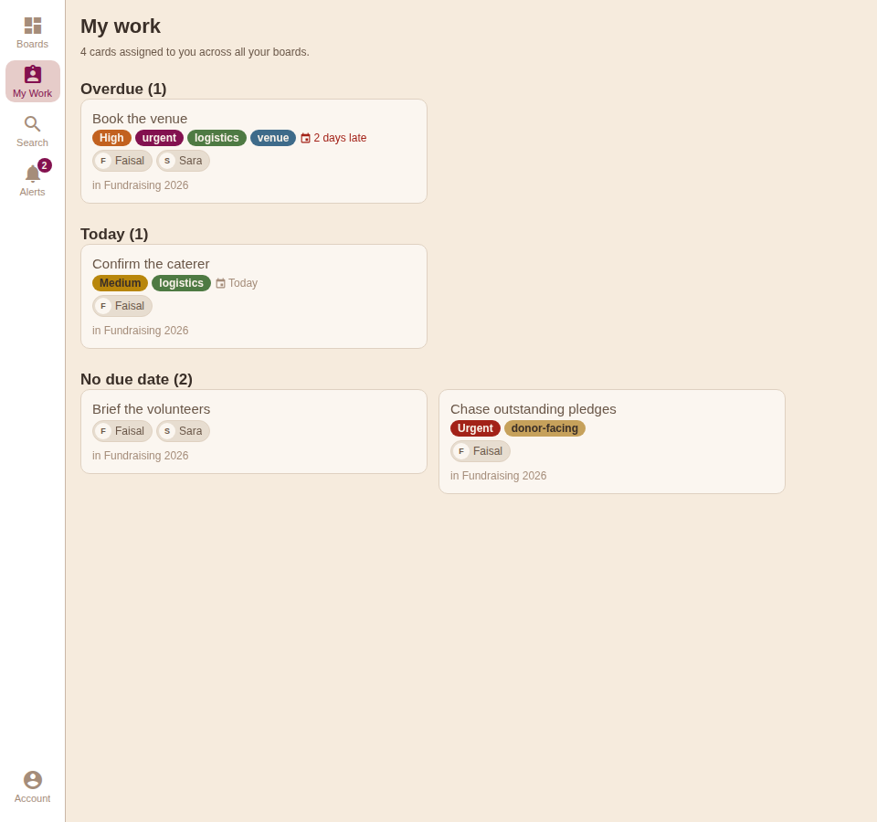<figcaption>In a browser</figcaption></figure>
  <figure>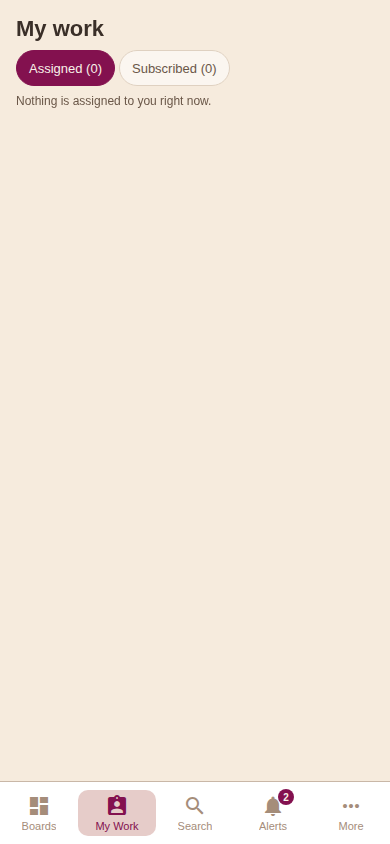<figcaption>On a phone</figcaption></figure>

Everything assigned to you, across every board, grouped by urgency: **overdue**
first, then **today**, then the **next seven days**, then everything else. This is
the fastest way to see what needs you — especially on a phone. Tap any card to
open it.

## 1.8 Search

  <figure>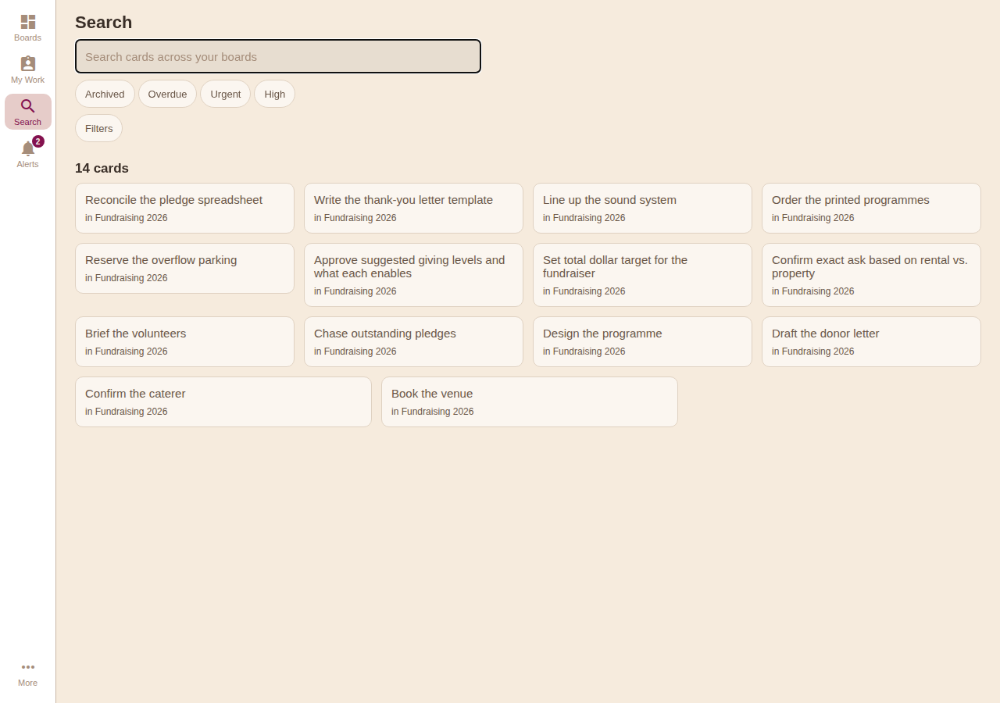<figcaption>In a browser</figcaption></figure>
  <figure>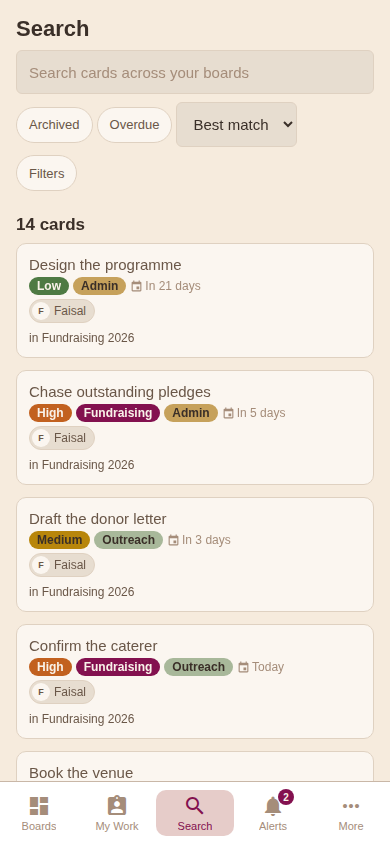<figcaption>On a phone</figcaption></figure>

Search lists **every card on every board you're on**, newest first — you don't
have to type anything, and **the keyboard stays shut** until you tap the box, so
you can browse and filter without it covering half the results. Typing narrows by
title and description; it matches whole words and parts of words, but not
misspellings.

Above the results are **filter chips**. The first row is one tap each, plus the
sort control:

- **Archived** — shows **only** archived cards, and hides the live ones. This is
  the other way to find something you archived, alongside a board's own archive.
- **Overdue** — only cards past their due date.
- **Sort** — see below.

  <figure>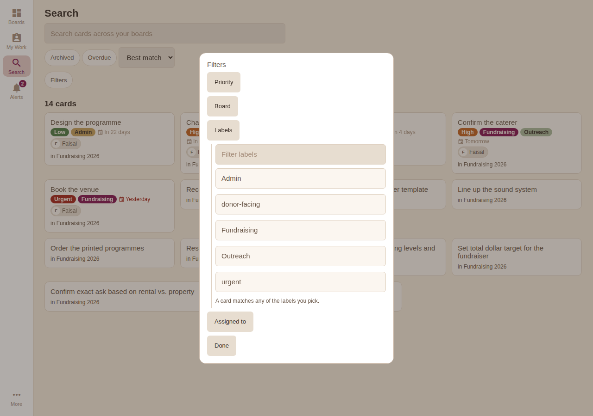<figcaption>The Filters panel</figcaption></figure>
  <figure>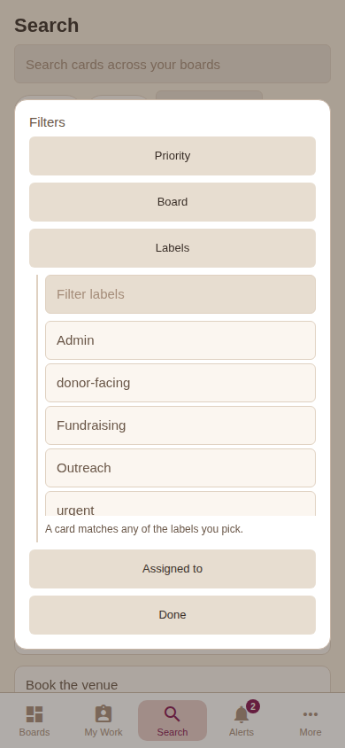<figcaption>On a phone</figcaption></figure>

The second row starts with **Filters**, which opens a panel holding everything
that is a *list of choices* rather than a switch. The sections start closed; tap
one to open it, and it closes whatever was open before — so the panel stays
readable on a phone. Each heading tells you what it is doing without being
opened (`Board: Fundraising 2026`, `Labels (2)`):

- **Priority** — pick any number of them: **Urgent**, **High**, **Medium**,
  **Low** and **None**. Picking two gives you cards at either. **None** means
  cards with no priority set — it is a choice, not "no filter".
- **Board** — narrow to a single board.
- **Labels** — pick one or several; you get cards carrying **any** of them.
- **Assigned to** — narrow to one person's cards, or back to **Anyone**.

Board, Labels and Assigned to each have a **box to type in** at the top, which
narrows the list as you type — quicker than scrolling once there are a lot of
boards or people.

Picks take effect straight away and the panel **stays open**, so you can set
several without reopening it. **Done** closes it.

Whatever you pick comes back as **its own chip** in that second row, so the
answer to "what am I filtering by?" is always one row you can read at a glance —
and tapping a chip removes that filter, the same gesture as everything else. When
anything is active, a **clear-filters** icon appears at the end of the row and
switches every filter off at once. It is only there when there is something to
clear, and the panel carries a **Clear all** button that does the same, because
the panel covers the icon while it is open. Your **Sort** is not a filter and
neither control touches it — the order you chose stays where you put it.

### Sorting

The **Sort** control has three settings:

- **Best match** (the default) — with something typed, the closest matches come
  first; with the box empty, the most recently active cards do.
- **Newest first** — most recently active at the top, whatever you've typed.
- **Oldest first** — the reverse, which is how you find the things nobody has
  touched in months.

"Active" means someone **edited the card, commented on it, or attached or removed
a file**. Just opening a card doesn't count, and neither does subscribing to it.

**Your search survives leaving it.** Open a result, then come back, and the text,
the chips and the board and label picks are all as you left them — you don't have
to rebuild a search to look at a second card. Filters reset when the app is
reloaded, because a filter you set last week isn't one you meant to still be
looking through today.

Search looks at the WORDS you see, not at the formatting, so searching for
`bold text` finds a card that shows **bold** text. One honest limit: it searches
the words of a link, not the address behind it.

If there are more results than fit on screen the app says so, rather than quietly
cutting the list short. Tap a result to open the card.

## 1.9 Notifications

  <figure>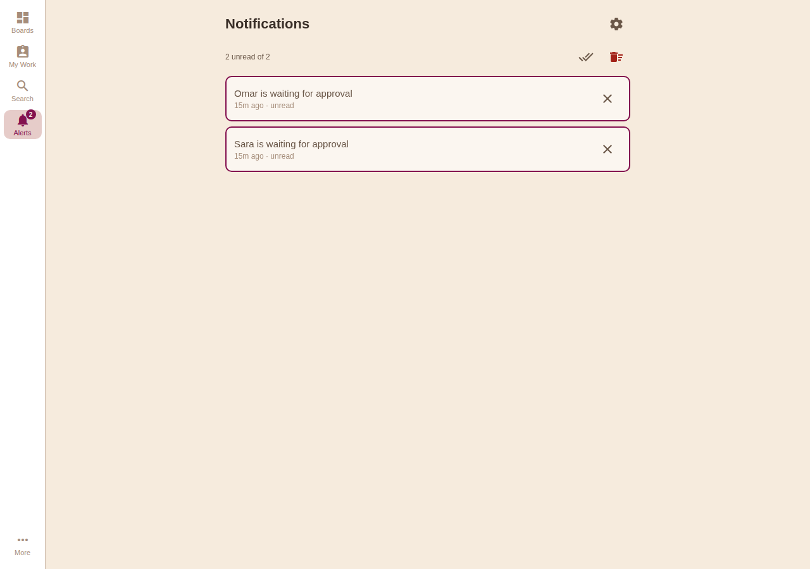<figcaption>In a browser</figcaption></figure>
  <figure>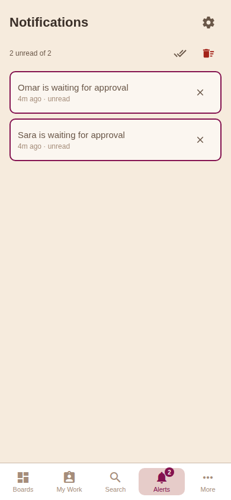<figcaption>On a phone</figcaption></figure>

**Alerts** shows everything you've been told about, so nothing is lost if a phone
notification is missed or swiped away. You're alerted when a card is **assigned**
to you, when someone **@mentions** you in a comment, and — for admins — when a
**new account** is waiting. Unread items are outlined; tap one to go straight to
what it is about — the card for a card alert, **People** for an account waiting
for approval. Tapping the notification on your phone's lock screen or in its
notification tray does the same thing, including when the app was not running.

Each item has a **✕** to dismiss it. At the top of the list, **✓✓** marks
everything read and the **sweep** icon empties the inbox — that one asks first,
because dismissed alerts cannot be brought back.

Alerts keeps the last **90 days** and clears out anything older on its own, so
the list stays worth reading. Nothing is lost by it — a card keeps its own
comments and activity permanently.

The **gear** opens notification settings, where each kind of notification has an
on/off switch and you can **mute** individual boards with the bell. One kind is
off by default — "a card assigned to you was moved" — because on a busy board it
fires constantly. **You are never notified about your own actions.**

Push notifications need the device's own permission. The app offers to set it up
once, on the Boards screen after you sign in — or you can open the **gear** here
any time and use **Enable notifications**. It is once per device, and this screen
always says where this device stands — including after you change the setting
outside the app and come back to it. If notifications have been blocked, the
button becomes **Open settings** on a phone; in a browser, allow them from the
site settings behind the icon in the address bar. Notifications follow the
account signed in on the device.

## 1.10 Signing out

**More → Sign out** (in the navigation bar). Signing out clears your session on
this phone or browser and stops it receiving that account's notifications. The
next sign-in shows Google's account chooser, which is how you switch accounts.

---

# Part 2 — For board owners

Two separate things decide what you can do, and it is worth being clear about
which is which.

**Your role** — set by an admin under **People** — says what you can do across
the whole organisation. There are three:

- **Member** — the boards you've been added to, and nothing else.
- **Organizer** — the same, plus **creating new boards**. That is the whole of
  the difference.
- **Admin** — everything, including every board. See Part 3.

**Owning a board** is separate, and belongs to the board rather than to you.
Whoever creates a board owns it, and an owner can make any other member an owner
too. Owning a board says nothing about any other board: a plain member can own
one, an organizer can own none.

**An owner runs the board**: its name, its columns, who is on it, who else owns
it, archiving it, permanently deleting its cards, and removing anybody's comment.

Everyone else on the board opens the same screen and sees **the member list,
read-only, with owners marked** — so you can always see who to ask.

## 2.1 Creating a board

*Organizers and admins.* On **Boards**, tap **New board** and give it a name.
Every new board starts with three columns — **To Do**, **In Progress**, **Done**
— which you can rename or replace in Settings. **You own the board you create**,
and only an admin can change that.

## 2.2 Board settings

  <figure>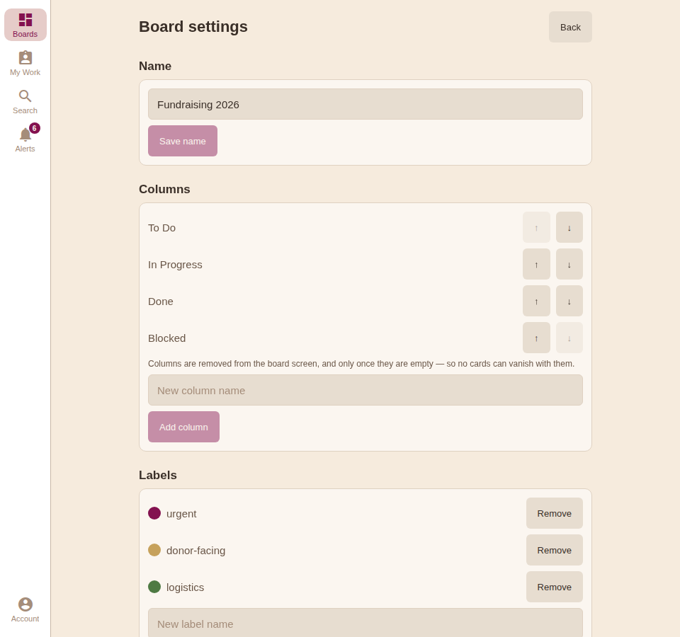<figcaption>In a browser</figcaption></figure>
  <figure>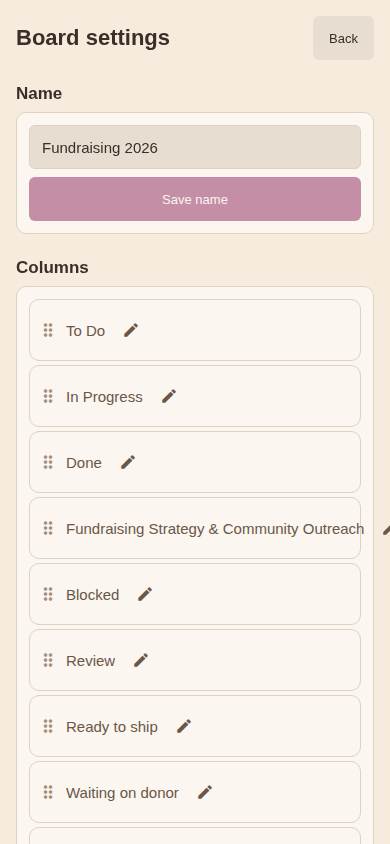<figcaption>On a phone</figcaption></figure>

Open a board and tap its **settings** (the gear — along the bottom on a phone,
in the header in a browser). If you don't own the board the icon is a **group of
people** instead and says **Board members**: the same screen with the member list
and nothing else.

  <figure>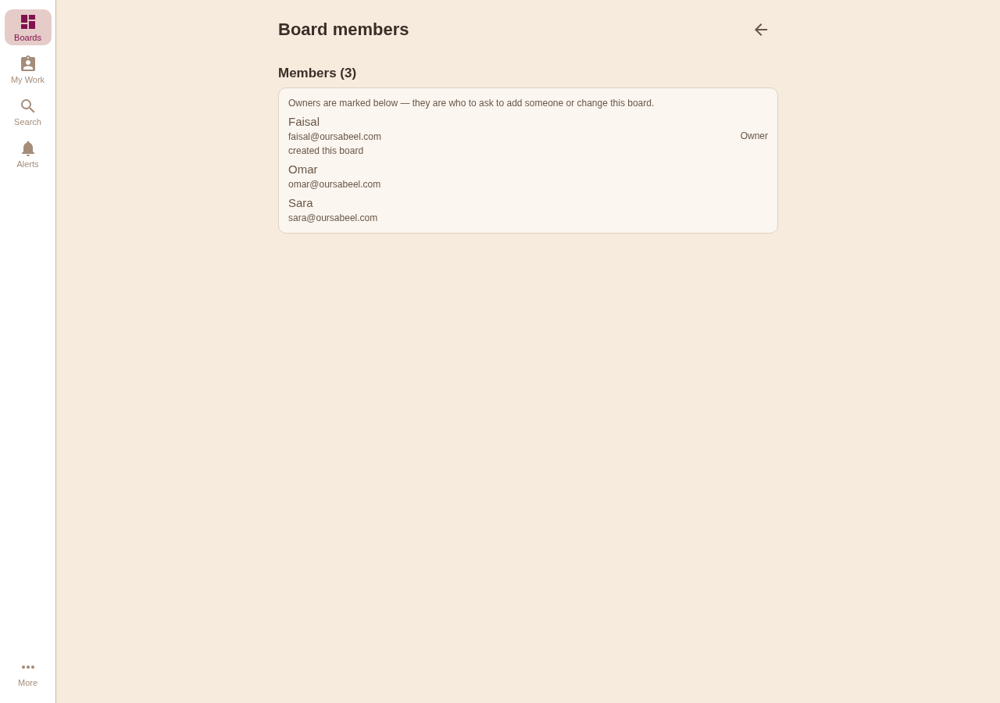<figcaption>Not an owner, in a browser — owners marked, no controls</figcaption></figure>
  <figure>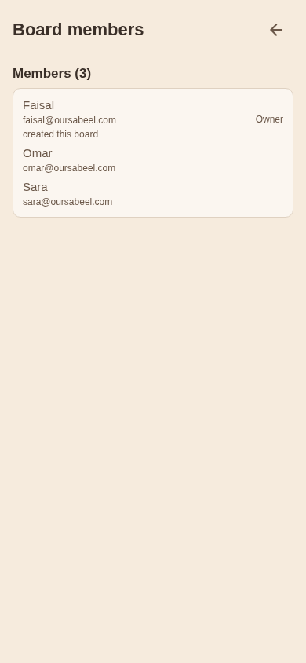<figcaption>The same on a phone</figcaption></figure>

From here:

- **Name** — rename the board. This screen is the only place that does it, which
  is why a member who cannot open it cannot rename a board either.
- **Columns** — add, rename, and reorder. Tap the **pencil** beside a column's
  name to rename it; drag the handle to reorder. A column can only be deleted
  once it's **empty**, so no cards vanish with it, and deleting one **asks first**
  because it cannot be undone. To clear a column quickly, select its cards and
  move or archive them in one go.
- **Labels** — one vocabulary shared by **every board**, not just this one, so
  anything you do to a label here changes it everywhere. The panel says so.

  **Anyone can add one**: open any card and press **+** beside its labels, and it
  joins the shared set and lands on that card at the same time. **Only an admin
  renames, recolours or deletes one** — a label is shared, so changing it reaches
  cards on boards you may not even be able to open, and that is an organisation-
  wide decision rather than a board one. If you own a board but are not an admin
  you will see the labels listed with no controls beside them.

  Admins get a **pencil** to rename, a **palette** to cycle the colour and a
  **bin** to delete. Deleting asks first and tells you how many cards carry it,
  because it comes off all of them.

  Colours come from a fixed palette so they stay readable on the app's warm
  surfaces. Names are short by design, and two labels can't share a name even in
  different capitals — a card face shows the name and nothing else, so "Urgent"
  and "urgent" would be impossible to tell apart.
- **Members** — who can see the board. Tap the **add-person** icon beside the
  *Members* heading to see who else can be added, and tap a name to add them.
  Removing someone (the **remove-person** icon on their row) also **unassigns them
  from that board's cards** — you're told how many before it happens — and takes
  away their ownership of it if they had any. **Adding them back later does not
  give the ownership back**; turn the switch on again if you mean to. Your **own**
  row shows a **leave** icon instead — use it to step off a board you no longer
  work. Members who don't own the board ask an owner to take them off it.

  Somebody removed while they have the board open is told they no longer have
  access to it, rather than being left looking at a screen that will not load.
- **Owners** — each member's row carries an **Owner** switch. See below.
- **Archive** — hides the board from everyone's list. Boards are never deleted
  outright.

### Letting somebody else run the board

  <figure>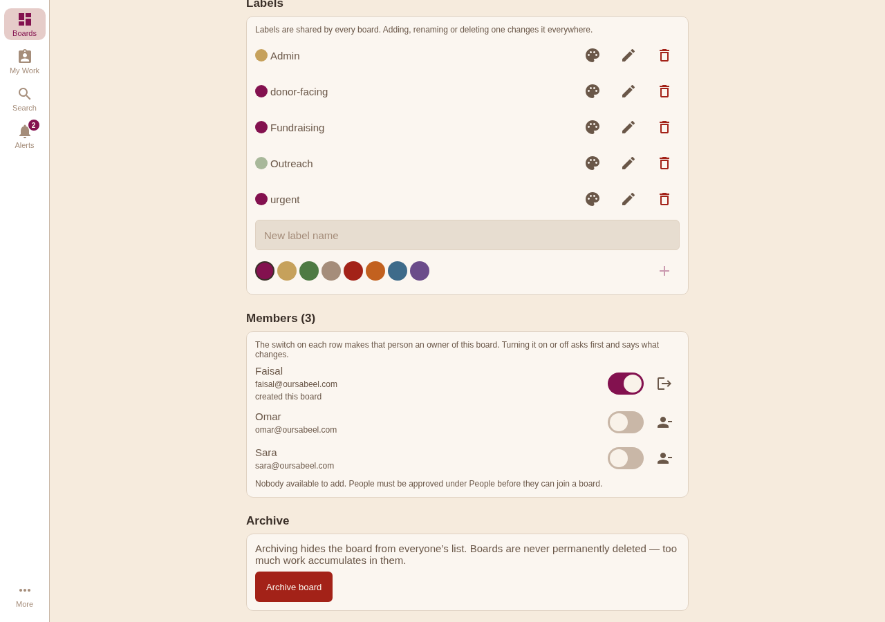<figcaption>In a browser — the Owner switch sits on each member's row</figcaption></figure>
  <figure>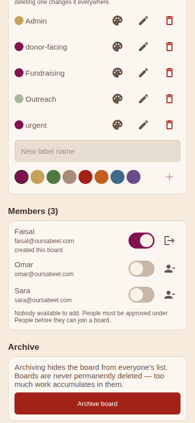<figcaption>On a phone</figcaption></figure>

Turn a member's **Owner** switch on and they can run the board exactly as you
can; turn it off and they go back to being an ordinary member, keeping the board
and everything on it. **Both directions ask first** and spell out what changes,
so a stray tap grants nothing.

Unless you created the board, you can step down the same way — your own switch
works like anyone else's. The confirmation is worth reading: **you cannot undo
it.** You stay on the board and keep using it, but another owner or an admin has
to give ownership back. Step down as the last owner and only an admin can change
the board at all.

The person who **created** the board is marked *created this board*, and their
switch is locked: **only an admin** can take ownership away from them — even when
it is you and you want to hand the board on. Ask an admin.

A board can end up with **nobody** owning it — its creator left it, or an admin
took the last owner off. Nothing is lost, but only an admin can change that board
until somebody is made an owner again.

**Renaming a column without opening Settings.** Column names are editable from
the board itself too — tap the **pencil** beside the column name (on a phone, in
the column header at the top; on a wide screen, at the top of each column). Only
the board's owners and admins see it; everyone else just sees the name.

**Joining or leaving a board yourself.** Neither is self-service for an ordinary
member: an owner of the board adds you, and an owner takes you off. **Leave** is
on your own row in *Members* if you own the board. (Admins are the exception,
since they can open any board's settings; a board they haven't joined shows a
**Join this board** button at the top of *Members*.)

## 2.3 Archiving a board

Boards **archive**, they don't get hard-deleted, so nothing is lost by accident.
An **Archived** section sits at the bottom of your board list, holding the
archived boards you belong to — open one from there and use **Restore** in its
settings to bring it back. It stays collapsed unless something is actually
archived, and only an owner of that board (or an admin) can restore it.

Archiving a board **puts its work away too**: its cards drop out of everyone's
**My Work** and **Search**, and it stops sending notifications and due-date
reminders. Nothing is deleted — restore the board and all of it comes straight
back, exactly as it was.

## 2.4 Deleting cards

**Anyone on the board archives** cards; **its owners and admins can delete** them
permanently. Archiving keeps a card out of the way but recoverable; deletion is
final and takes its comments and history with it. When in doubt, archive.

---

# Part 3 — For admins

Admins manage **people**, curate the shared **labels**, and read **Stats**. They
can also open, run and join **every** board, whether or not they were added to
it — the one exception to boards being private.

## 3.1 The People screen — approving new users

  <figure>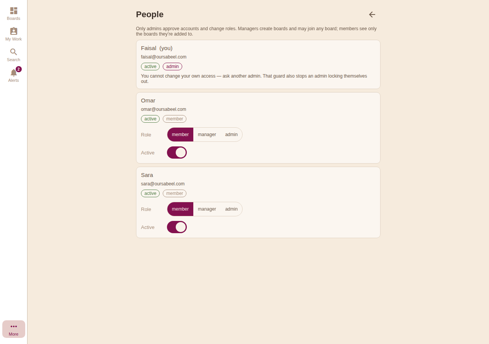<figcaption>In a browser</figcaption></figure>
  <figure>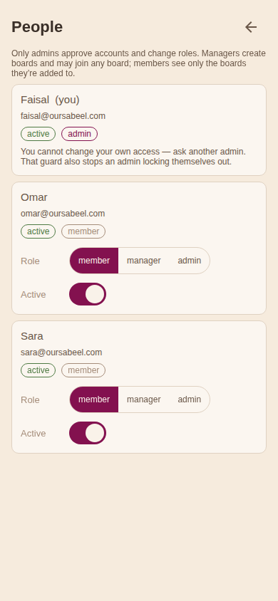<figcaption>On a phone</figcaption></figure>

Open **More → People**. It lists everyone who has signed in. A new account
waits on **pending** and sees nothing until you approve it — approve it here and
their screen unlocks live, wherever they are. Admins also get a push notification
when someone is waiting.

## 3.2 Managing a user

Each person's role and access are shown as **controls set to their current
value** — a **role** (member / organizer / admin) and an **Active** toggle —
rather than buttons you press. You change someone by moving the control to where
you want it:

- **Member** — sees only the boards they've been added to.
- **Organizer** — the same, plus **creating boards**. That is the only
  difference. They own the boards they create, and nothing on anyone else's.
- **Admin** — everything: every board, the shared labels, Stats, and approving
  accounts and changing roles.
- **Active** — turn off to **disable** an account. Whatever they have open
  switches to an "Account disabled" screen straight away, wherever they are, and
  they cannot sign back in. **Their card assignments are kept** so nothing is
  left ownerless — an owner of that board can reassign at leisure. Turn back on
  to restore. Nothing is ever deleted.

  If they are the **only owner of a board**, the confirmation names it. Disabling
  still goes ahead — losing access is usually the urgent half — but that board
  then needs a new owner, which you can give it from its settings.

Every change asks you to **confirm**, spelling out what it will actually let that
person do, so a stray tap can't promote or lock out anyone. You **cannot change
your own access** — that's what stops an admin locking themselves out.

**Who runs a board is NOT set here.** It is set on the board, under
*Board settings → Members*, and is independent of the role above. An admin can
open any board and give anybody ownership of it.

## 3.3 Stats — how the boards are being used

  <figure>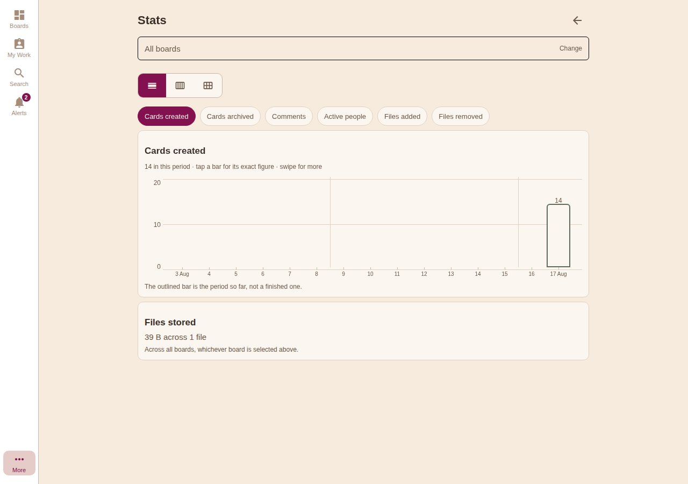<figcaption>In a browser</figcaption></figure>
  <figure>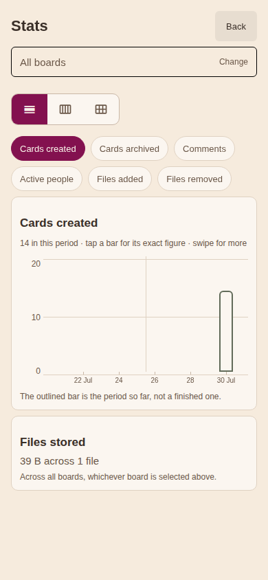<figcaption>On a phone</figcaption></figure>

**More → Stats.** Admins only. It answers "is this being used, and by whom?" —
nothing about individual performance, and nothing you can drill into a person
with.

Three controls sit above the chart:

- **The board** — one board, or **All boards**. Archived boards stay in the list
  and are marked, because archiving a board doesn't retract the work that
  happened on it.
- **Daily / Weekly / Monthly** — the three calendar icons. Weeks run
  **Sunday to Saturday** and months are real calendar months, not rolling
  windows, so a week here is the week everyone means.
- **What to measure** — cards created, cards archived, comments, **active
  people**, files added, files removed.

**Active people** counts how many *different* people did something that day — not
who signed in. Opening the app changes nothing; creating a card, commenting or
attaching a file does.

The chart scrolls sideways when there are more bars than fit; **tap a bar** for
its exact figure and date. The **last bar is outlined rather than filled** because
today isn't finished yet — a half-day next to whole ones would read as a decline
that hasn't happened. Below it, **Files stored** gives the total size held across
all attachments.

### Tap a bar to see what is behind it

  <figure>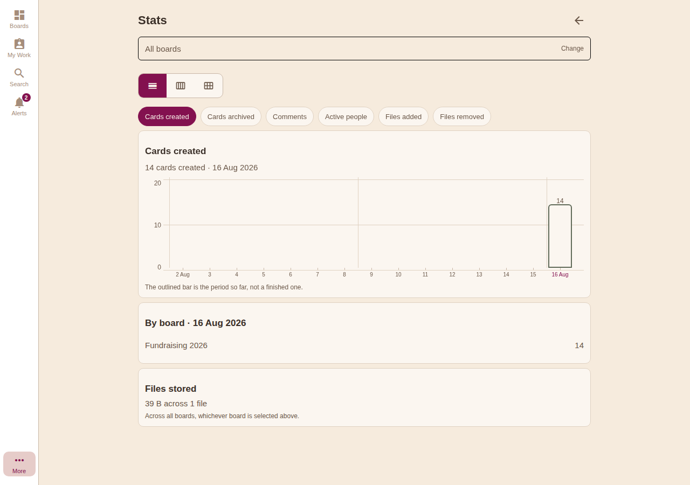<figcaption>In a browser</figcaption></figure>
  <figure>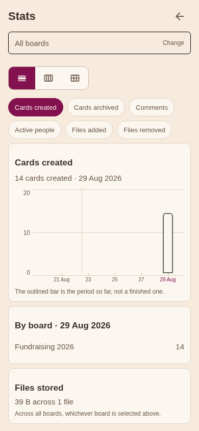<figcaption>On a phone</figcaption></figure>

Selecting a bar adds a panel underneath it, and what the panel shows depends on
what you are measuring:

- **Active people** lists **who** — the actual people who did something in that
  day, week or month.
- **Everything else** lists **which boards**, largest first. **Tap a board to go
  straight to it.**

Tap the same bar again to put the panel away. There is no panel until you select
something, on purpose: without a bar chosen it would have to cover the whole
year, which is a different question.

Come back from a board and Stats is exactly as you left it — same board filter,
same period, same measure, same bar selected.

History goes back **twelve months** and is kept indefinitely. Figures for past
days are counted once and stored, so the screen opens instantly however much
history there is; only the current day is worked out live.

---

# Part 4 — "How do I…?" quick answers

**…get in for the first time?**
Sign in with your @oursabeel.com Google account, then wait on the approval screen
until an admin lets you in (it updates by itself).

**…add a card?**
Open the board → **+ Add card** at the foot of a column → type a title → Enter.

**…change a card's priority, due date, or assignees?**
Open the card → tap a priority / due date / **Assign someone** → choose.

**…move a card to another column?**
In a browser, drag it. On a phone, long-press it and pick the column — or open the
card and change the **column** dropdown.

**…move or copy cards to a *different board*?**
Select them (tick boxes, or long-press on a phone) → **move**/**copy to another
board** → pick the board and column.

**…find a card I can't see?**
**Search** (its words), or **My Work** if it's assigned to you.

**…share a card with a colleague?**
Open the card → **Share** → send the link. They open it and land on the card (if
they're a member of its board).

**…see everything assigned to me?**
**My Work** — grouped overdue → today → next seven days.

**…stop a noisy notification?**
**Alerts → Settings** → switch off that kind, or **mute** the board.

**…create a board?** *(organizers and admins)*
**Boards → New board** → name it. You own the board you create.

**…rename a board?** *(the board's owners)*
Open the board → **settings** → Name. That screen is the only place that does it.

**…rename or add columns?** *(the board's owners)*
Open the board → **settings** → Columns.

**…add a label?** *(anyone)*
Open any card → **+** beside its labels. Labels are shared by every board, so it
appears everywhere at once.

**…rename or delete a label?** *(admins)*
Open any board → **settings → Labels**. Deleting removes it from every card that
carries it, and tells you how many first — counting live cards and archived ones
separately, because a card in the archive is one no board will show you.

**…follow a card that isn't mine?**
Open it → the **bell** in the header. It appears under **My work → Subscribed**,
and you'll hear about new comments.

**…find every card with a particular label?**
**Search → Filters → Labels**, and pick one. Pick more than one and you get cards
carrying **any** of them. Each pick becomes a chip; tap it to drop it.

**…search within one board only?**
**Search → Filters → Board**. It becomes a chip like everything else — tap the
chip to go back to searching everywhere.

**…find everything urgent *or* high?**
**Search → Filters → Priority**, and tap both. Priority takes as many as you
want, unlike the other sections.

**…find cards nobody has given a priority?**
**Search → Filters → Priority → None.**

**…see what someone else is working on?**
**Search → Filters → Assigned to**, and pick them. Type in the box at the top of
the list to find them quickly.

**…see what's changed lately — or what has gone stale?**
**Search → Sort → Newest first** for the first, **Oldest first** for the second.
"Active" counts edits, comments and files.

**…give a file a sensible name?**
Rename it in the box that appears when you pick it, **before** it uploads. You
cannot rename it afterwards — remove it and attach it again.

**…clear every filter at once?**
The **clear-filters** icon at the end of the chip row, or **Clear all** inside
the Filters panel. It only appears when something is actually filtering, and it
leaves your **Sort** alone.

**…see how much the boards are being used?** *(admins)*
**More → Stats** — cards created and archived, comments, how many different
people were active, and files, by day, week or month.

**…see which boards those numbers came from?** *(admins)*
**Tap a bar.** The panel underneath lists the boards behind it, largest first,
and tapping one opens that board. On **Active people** it lists the people
instead.

**…add someone to a board?** *(the board's owners)*
Board **settings → Members** → add them. (They must be an approved account first.)

**…let someone else run a board with me?** *(the board's owners)*
Board **settings → Members** → turn on **Owner** on their row → confirm.

**…find out who runs a board I'm on?** *(anyone)*
Open the board → **Board members** — or **Board settings**, if you are one of
them. Same screen; owners are marked on it either way.

**…hand a board on when I created it?** *(needs an admin)*
Ask an admin. Only they can take ownership off whoever created a board — the
creator cannot even do it themselves.

**…delete a card?** *(the board's owners, and admins)*
Open the card → delete. Everyone else **archives** instead.

**…let a new team member in?** *(admins)*
They sign in once with Google → **More → People** → **Approve** their pending
card.

**…make someone an organizer or admin?** *(admins)*
**People** → their card → set the **role** → confirm the dialog. This does NOT
decide who runs a board — that lives on the board itself.

**…disable someone who left?** *(admins)*
**People** → their card → **Active** off → confirm. Their assignments and history
stay.

---

## Troubleshooting

| What you see | What it means | What to do |
|---|---|---|
| "Waiting for approval" after signing in | Your account awaits admin approval | Ask your admin; the screen unlocks by itself once approved |
| You can't sign in at all | Only @oursabeel.com Google accounts are allowed | Use your work account, not a personal one |
| A card's due date is red | The card is overdue | Open it and update the date, or get the work done |
| "This card is unavailable" from a shared link | You're not a member of its board, or the card was deleted | Ask one of that board's owners to add you |
| A column won't delete | It still has cards in it | Move or archive its cards first, then delete the column |
| Removing a board member warns about cards | They're assigned to cards on that board | Those cards are unassigned automatically; the warning just says how many |
| No push notifications arriving | Permission not granted on this device, or that kind is muted | Allow notifications when the app asks, and check **Alerts → Settings** |
| A red "Live data error" bar | The app couldn't reach the server | It clears when the connection recovers, and when you leave the screen; if it persists, tell Faisal what the bar says |
| "You no longer have access to this board" | Somebody removed you from it, or archived it, while you had it open | Go back to your board list. Ask one of that board's owners if you should still be on it |
| Text you underlined loses its underline | Cards hold bold, italic, lists and links — underline is not one of them, and a keyboard shortcut can set it even though no button offers it | Use **bold** or *italic* instead |
| Pasted text lost its headings or colours | Only the five formatting options survive a paste — but every word does | Nothing to do; reformat the parts you want bold or bulleted |

*Manual source: `docs/USER-MANUAL.md`. Its images live in `docs/manual/img/` and
are regenerated from the seeded dev stack by `node scripts/manual-shots.mjs`
(every one except `pending.png`, which needs an unapproved account). The PDF is
built from the markdown by `python3 docs/render-manual.py`. When the app
changes, update all three in the same batch — text, images, PDF.*
